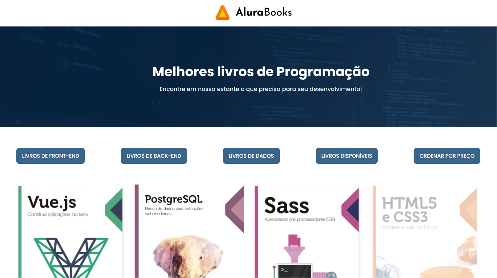

<h1 align="center"> Alura Books </h1>

Neste projeto o objetivo foi consumir uma API para buscar as informações fornecidas e as exibir na tela

  <a href="#-tecnologias">Tecnologias</a>&nbsp;&nbsp;&nbsp;|&nbsp;&nbsp;&nbsp;
  <a href="#-projeto">Projeto</a>&nbsp;&nbsp;&nbsp;|&nbsp;&nbsp;&nbsp;
  <a href="#memo-licença">Licença</a>

  

 

  

## 🚀 Tecnologias

Esse projeto foi desenvolvido com as seguintes tecnologias:

- HTML e CSS
- JavaScript
- API
- Git e Github

## 💻 Projeto

Porojeto de treinamento "JavaScript: métodos de array" da Alura Cursos Online.

## :memo: Licença

Esse projeto está sob a licença MIT.

---

Feito com ♥ by Arthur Oliveira
